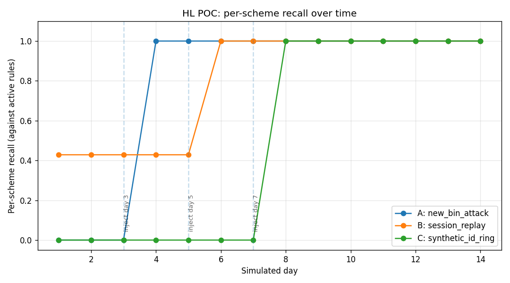

# When Rules Beat Retraining

*Applying Heuristic Learning to fraud detection — a working argument for why
the next paradigm in operational ML might not involve more gradients.*

---

A few weeks ago I read [Learning Beyond
Gradients](https://trinkle23897.github.io/learning-beyond-gradients/), in
which Trinkle argues that explicit, editable software systems — rules,
state machines, controllers — maintained by an LLM coding agent can match
or exceed gradient-trained neural networks on a surprising range of tasks.
The headline result: a pure Python policy reaching the theoretical maximum
score on Atari Breakout, a Python MuJoCo Ant agent at 6,000+ points, all
without a single weight update. The thesis: *anything you can continuously
iterate on starts to become solvable*.

I wanted to know if this held outside the RL benchmarks where it was demonstrated.
So I built a working POC that applies Heuristic Learning to **fraud detection**
— a domain that, in production, already lives uncomfortably between machine
learning and human-authored rule engines. The full system is at
[github.com/geneweng/heuristic](https://github.com/geneweng/heuristic). What follows
is what I learned.

## The retraining problem

Every fraud team I've worked with runs the same playbook. A model — usually
gradient-boosted trees, sometimes a deep net — scores each transaction. A
human-authored rule engine catches the patterns the model misses, or the ones
the model's confidence is too brittle to handle. When fraud schemes shift,
two things have to happen:

1. **The rule engine gets a new rule**, written by an analyst, after a few
   chargebacks come in and a pattern becomes visible.
2. **The model gets retrained**, eventually, once enough labels have accumulated
   to make a new training run worthwhile.

The retraining cadence is the slow path. It takes weeks. A new model has to
pass an A/B test, get sign-off from risk and compliance, and ship through
whatever change-control process the company has. Meanwhile, the rule engine
absorbs everything urgent.

The rule engine has its own problem: it grows. Rules outlive their authors.
Rules contradict each other. Nobody can confidently delete an old rule
because nobody is sure what it still catches. The rule engine becomes a
graveyard of tribal knowledge.

What if the rule engine were *also* an iterative learning system — one
that could *write* and *retire* rules without a human typing them, while
keeping every rule plain-English readable for the compliance reviewer who
has to sign off?

That's the HL pitch. Let's see what it looks like in practice.

## The architecture

Mapped to the components Trinkle defines in the paper:

| HL component        | Fraud-detection implementation                                  |
|---------------------|-----------------------------------------------------------------|
| Programmatic policy | A directory of named Python rule files. Each file = one scheme. |
| State representation| A `Transaction` schema plus an `EntityContext` of rolling per-card aggregates. |
| Feedback channels   | A `labels/` file the analyst UI appends to. |
| Experiment records  | A `runs/` JSONL the orchestrator writes after every decision. |
| Replays / tests     | A labeled corpus the rule engine is replayed against on every PR; per-scheme recall floors fail CI on regression. |
| Memory              | `memory/attempts.jsonl` (every proposal, accepted or rejected) and `memory/rejections.jsonl` (don't re-propose this for 14 days). |
| Update mechanism    | A "reflector" — a Claude coding agent that clusters missed cases, proposes rules, and opens PRs. |

The ML part is a frozen gradient-boosted classifier. It does the volume work
— scoring every transaction, contributing 80% of the system's detection
power. The HL part is the diff to that: when ML misses a new scheme, the
reflector writes a rule.

Critically, the ML model **never retrains** during the POC. Every new
detection — every percentage point of recall added after deployment — is
attributable to a rule the reflector wrote and a human approved.

## A day in the loop

I'll describe what happens when a new fraud scheme appears. The
[Demo-Scenario.md](./Demo-Scenario.md) in the repo walks through this in
more detail, but the shape:

**Day 3.** A fraud ring lights up a freshly-issued BIN range, abusing it
for low-amount online cash-outs in Austria. The frozen ML hasn't seen this
BIN. The five seed rules don't pattern-match (no burst, no geo jump, no
decline retry). Seven of these auths approve.

**Day 4 morning.** A chargeback prompts an analyst to look. She labels the
seven txns `fraud` in the Streamlit UI, leaves a short note: "Brand-new
BIN, cash-out, AT corridor. Smells like new-issuer laundering." The UI
appends to `labels/labels.jsonl`.

**Day 4 evening.** The reflector wakes on its nightly cron. It joins
`runs/` with `labels/`, finds the seven false negatives, and clusters them
by feature bucket. All seven share the same bucket — same country, same
merchant category, same age range, same amount band. Claude is prompted
(via tool_use, with a strict schema) to propose a rule. It returns a
Python predicate plus a docstring naming the scheme. The predicate gets
compiled and run through four guards: no identity literals, holdout
precision above floor, false-positive rate on legit traffic below cap, no
existing rule already covers > 70% of the cited evidence. The proposal
passes. The rule file is materialized, replay is run (no regression on
prior schemes), a PR opens.

**Day 4 PR review.** CODEOWNERS requires a human reviewer on
`skills/fraud-rules/rules/**`. The analyst reads the docstring — a couple
of sentences naming the scheme an analyst would recognize — checks three
of the cited examples, approves, merges. The rule is live.

**Day 5 onward.** Recall on the BIN-654321 scheme goes from 0 to 1.0.
Recall on the five seed schemes stays flat at 1.0. The ML didn't move.

End-to-end time from first labeled false negative to merged rule: under 24
hours. That's the HL claim, made concrete.

## What the simulation shows

I ran a 14-day simulation that injects three schemes at day 3, day 5, and
day 7. None of them is catchable by the frozen ML; each is catchable by a
rule the reflector could plausibly write.



The shape that matters:

- Each scheme jumps from ~0 to 1.0 within a simulated day of being labeled.
- The seed-scheme recall (not pictured — flat at 1.0 throughout) doesn't
  move. There's no catastrophic forgetting because the replay-floor check
  fails any PR that would regress an existing scheme.
- The chart is the headline deliverable. It's reproducible from the synthetic
  data the repo ships; no Kaggle account, no API key.

One scheme (session_replay) starts at 0.43 recall before any reflector
work, because the seed `device_shared_across_cards_v1` rule already
fires on three of its seven cases. The reflector's contribution is the
remaining four — a partial match that becomes a full match the day after
labels arrive.

## What this is good at

**Speed of response to novelty.** The fastest path to a new rule is hours,
not weeks. The bottleneck is the analyst's labeling step and the human PR
review, both of which the analyst-UI surface tries to minimize. Trinkle's
"direct code jumps vs. slow parameter tuning" framing is exactly right:
when you can jump from "I see a pattern" to "here is the predicate that
captures it" in one move, you don't need a training run.

**Explainability for free.** Every rule is a Python function with a
plain-English docstring. The compliance reviewer who has to defend this
to an external regulator can read the rule. The reviewer doesn't need a
SHAP plot or a counterfactual explainer. The rule is its own explanation.
This is HL's biggest win in regulated industries: the *system itself* is
documentation.

**Auditability for free.** Every rule change is a PR. `git blame` tells
you who approved it, what evidence it was proposed from (the PR body lists
cited txn IDs), and what guards it passed. When a future analyst wants
to delete a rule, she can read the history and decide. Compare to a
trained model, where "why does this fire?" requires a parallel system to
answer.

**Continual learning without catastrophic forgetting.** This is the part of
the HL paper I was most skeptical of. In our POC it just works — but only
because the replay corpus is what's preventing it. Strip out the
`floors.yaml` check and a new rule could easily change a seed rule's
behavior. The anti-forgetting story isn't "rules don't forget"; it's
"the test corpus is in version control, so forgetting is detected." That
distinction matters a lot in practice.

## What this is not good at

**Volume detection.** The frozen ML still does most of the work. The
reflector finds the cases ML missed; it isn't a replacement. Trinkle is
explicit about this — HL "cannot do everything neural networks can do,
particularly for complex perception and long-horizon generalization." For
fraud, where the input is mostly structured tabular data, this matters
less than for vision tasks; but even here, you would not throw away the
ML.

**Long-horizon planning.** No transaction in our system requires the
agent to plan more than one decision ahead. A rule fires or doesn't. The
HL paper's strongest results are also on tasks with short decision
horizons (single Atari frames, single MuJoCo control steps). I'd be more
nervous applying this to multi-step processes — workflow orchestration,
say — where errors compound.

**Adversarial domain shift.** A fraud ring that knew the system was
running could iterate on patterns specifically designed to slip past the
rules without triggering the clustering. The POC doesn't try to defend
against this. The mitigation is the same as for any ML system: don't
publish your rules, rotate them, and rely on the ML as the second
signal. None of those are HL-specific.

**The LLM is still the LLM.** It hallucinates. It writes overfit rules.
It cites the wrong evidence. The four guards
(`identity_features`, `holdout_precision`, `fp_cap`, `redundancy`) plus
the human reviewer are how the POC keeps this manageable. Without those,
the system would propose nonsense rules in production. With them, the
worst case is a rejected PR — which gets logged, and the same cluster
won't be re-proposed for 14 days unless the evidence doubles.

## Broader implications

The HL paper's slogan — *anything that can be continuously iterated on
starts to become solvable* — is genuine. The trick is recognizing which
business processes look like fraud detection in this sense:

- **Rule-based decisioning with feedback labels.** Fraud, AML, KYC,
  underwriting, content moderation, ad-creative approval. Anything with a
  human reviewer who eventually says "this was right" or "this was wrong."

- **A static base model that handles volume.** Need not be fancy. A
  gradient-boosted classifier is fine. The model is the substrate; HL is
  the diff.

- **A replay corpus.** This is the load-bearing piece. Without a
  test corpus that grows as the system runs, the anti-forgetting story
  collapses. Companies that don't already version their labeled data
  can't run an HL system safely.

- **A change-control process that wants every diff reviewed.** Banks,
  insurers, healthcare payers. Anyone whose audit trail matters. HL's
  PR-shaped output map naturally onto these workflows.

What HL won't do is replace the GenAI-everywhere pitch. It's narrower and
more disciplined. The model isn't running in the auth-decision hot path.
The LLM is on a nightly cron, writing code that gets reviewed by a human,
shipping diffs that ML systems would take weeks to ship through retraining.

That's worth a lot, but it's not magic. The novel observation from
working on this POC is that *the LLM coding agent doesn't have to be the
brain of the system to be load-bearing*. It can be the diff-writer, the
analyst extender, the rule rotator. The brain stays the GBM.

That's an architecture I'd actually deploy.

## How to reproduce

The repo at [github.com/geneweng/heuristic](https://github.com/geneweng/heuristic)
ships a working version of everything described above:

```bash
git clone https://github.com/geneweng/heuristic
cd heuristic
make install            # editable install
make data               # 100k synthetic IEEE-CIS-shape txns, deterministic
make ml-train           # train the frozen GBM
make results            # 14-day simulation; writes the headline chart
make ui                 # Streamlit analyst UI on localhost:8501
```

The live reflector (real Claude, real PR) needs `ANTHROPIC_API_KEY` and a
GitHub repo to push to. The dry-run mode runs the whole pipeline offline
with a deterministic stub proposer — useful for CI and for proving the
plumbing works without spending tokens.

The interesting code is small. The reflector loop is ~200 lines; the
guards are ~150; the clustering is 60. The total system is small enough to
read end-to-end in an afternoon.

## What I'd do next

Three threads I didn't pull on:

**Rule editing.** When a rule fires too often or too rarely, the reflector
should be able to *edit* it, not just append a new one. The redundancy
guard already detects when a proposal duplicates an existing rule; the
natural next step is to route those cases to an `edit_rule` prompt path.

**Real-time reflection.** The current loop runs nightly. In an incident,
you'd want it to run on every batch of new labels — the same loop with
different cadence. Just-in-time rule writing for active attacks.

**Multi-domain.** Fraud is one operationally-iterative business process.
SRE runbooks, marketing pricing rules, clinical decision pathways, trading
strategy parameters — all look the same from HL's vantage. A platform
that lets you point the reflector at your domain, with your replay corpus
and your CODEOWNERS, would be a real product.

I think Trinkle is right that this is a paradigm. I don't think it's the
*next* paradigm in the sense of replacing pretraining or RLHF. But it's
the next paradigm for the operational layer of ML — the part where models
meet the people who have to defend them, and where the cost of being wrong
is bounded by a code review.

That's a slice of the AI stack that doesn't get enough attention. And it
turns out the tools to build it well — coding agents, regression test
harnesses, version control for policies — already exist. The only thing
missing is the architectural conviction to stitch them together.

---

*The full POC, including the synthetic data generator, the four-guard
validation pipeline, the analyst Streamlit UI, and the 14-day simulation,
is at [github.com/geneweng/heuristic](https://github.com/geneweng/heuristic).
For Trinkle's original framing, see [Learning Beyond Gradients](https://trinkle23897.github.io/learning-beyond-gradients/).*
